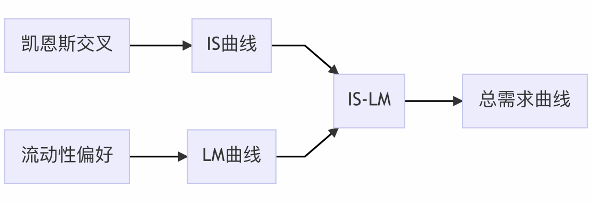

#### 第9讲 复习
##### (凯恩斯交叉，IS-LM)

雷浩然 

April's Fool Day, 2021

---

## 路线图

---

- 凯恩斯交叉是最基本的收入决定模型
  - 它将财政政策 (G)和计划投资 (I) 视作外生的
  - 均衡条件：实际支出等于计划支出

---

- 凯恩斯交叉是最基本的收入决定模型
  - 它将财政政策 (G)和计划投资 (I) 视作外生的
  - 均衡条件：实际支出等于计划支出

- 假设线性消费函数时，$Y=\frac{1}{1-\beta}(\alpha + I+G)$
   - 乘数效应
   - 政府购买乘数，税收乘数，平衡预算乘数 

---

若计划投资取决于利率:
- $Y=\frac{1}{1-\beta}(\alpha + I(r) +G)$

高利率降低了计划投资，进而降低了均衡收入：
- IS 曲线向下倾斜
- IS 曲线概括了产品市场均衡时的 $(Y,r)$

---

- 流动性偏好理论：利率决定模型
   - 货币供给和价格水平外生
   - 均衡利率调整使得实际货币余额供给=需求 

---

- 流动性偏好理论：利率决定模型
   - 货币供给和价格水平外生
   - 均衡利率调整使得实际货币余额供给=需求 

- 提高货币供给 $\Rightarrow$ 供给曲线右移$\Rightarrow$利率降低
   - 例外：流动性陷阱

---

若货币需求取决于收入 Y:
-  收入水平 $\uparrow$ $\Longrightarrow$  货币需求 $\uparrow$
-  LM 曲线向上倾斜
- LM 曲线概括了货币市场均衡时的 $(Y,r)$

---

## IS-LM

IS 与 LM 的交点：
  - 产品市场与货币市场同时达到均衡

---

## Reivew question

1. 用凯恩斯交叉解释乘数效应。
1. 用流动性偏好理论解释，为什么货币供给增加会降低利率。
1. 为什么 IS 曲线向下倾斜。
1. 为什么 LM 曲线向上倾斜。

---

- IS-LM 是关于产品与服务总需求的一般理论
  - 外生变量：价格水平，财政政策与货币政策

---

- IS-LM 是关于产品与服务总需求的一般理论
  - 外生变量：价格水平，财政政策与货币政策

特点：
- IS: 产品市场均衡时, $Y$ 与 $r$ 的负相关关系
- LM: 货币市场均衡时, $Y$ 与 $r$ 的正相关关系  
- (spoiler alert) 下一章推导总需求曲线 (AS)
   - P 是内生的

---

扩张性财政
- $G \uparrow$
- $T \downarrow$

IS 曲线右移
- 均衡利率上升，均衡收入上升

---

紧缩性财政
- $G \downarrow$
- $T \uparrow$

IS 曲线左移
- 均衡利率下降，均衡收入下降

--- 

扩张性货币
- $M \uparrow$

LM 曲线下移
- 均衡利率下降，均衡收入上升

---

## Review

1. 税收增加对利率，收入，消费和投资的影响。
1. 货币供给增加对利率，收入和投资的影响。

---

## 《课程调查》问卷结果

问题

- 讲得“有点快”

---

## 《课程调查》问卷结果

问题

- 有些课本上的内容没有讲，有些课本上没有但是讲了。分不清重点。

---

- 课本写得很“烂”。
  - 理论不清晰，而且有很多小错。
- 一般教学流程：
  1.  我会先**按照理论脉络**讲一遍。
  我认为课本写得不清楚的地方，会发讲义
  1. 然后，补上一些琐碎的知识点。
  1. 最后还没讲的内容：不重要，或很简单你可以自己看书，或我也不懂...

---

## 可能“有待商榷”的批评

- PPT 太简洁
- 英文太多
   - 术语的英文是必要的。比如 MPS
   - 我尽量不讲术语外的英文， 比如 M over P... (My bad)

---   

## 可能“有待商榷”的批评

内容“太高大上”，不接地气

- 同学，宏观经济学就是这么“高大上”

---

## 可能“有待商榷”的批评

课堂交流过多，少点同学回答。

---

## 可能“有待商榷”的批评

课堂交流过多，请少点同学回答。

- 课堂交流不是太多，而是**太少**。
- 经济学有逻辑，也有**思辨**。
  学会倾听并理解其他同学的思路。这不是浪费时间，对自己的理解也有帮助

---

## 无效问卷

很多同学表达了不满，但是没有说明对什么不满

- 请提出建设性意见

其他匿名沟通渠道：
- 给我发qq消息，不实名就行

---

## 考试考什么？

---

## 考试考什么？

- 我也不知道。
   - 课程网站有往年样卷，可以参考

---

## 考试考什么？

- 我也不知道。
   - 课程网站有往年样卷，可以参考

- 不要以考试为目标而学习
   - **知识，事实，经济学的思维方式**更重要
   - 积极思考，**多问问题**更重要 

---

- 有习题课 + 考前复习
  - 只要平时认真听讲，有问题问老师或其他同学，不会考不好

---

- 不想参与课堂互动的，请私下告诉我。
  我会把你从名单划掉。