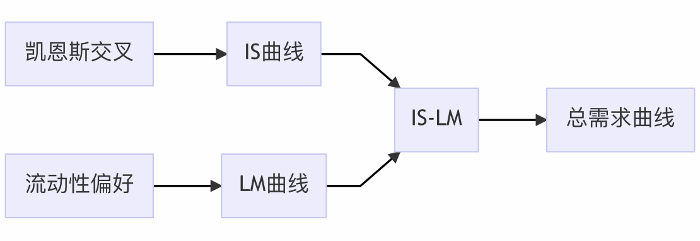

#### 第十讲 《宏观经济学》

雷浩然 湖南大学经贸学院

2021-04-08 

---

## Review

---

教学顺序上，很多内容是递进的。前面学过的内容，是后面内容的基础
- 凯恩斯交叉 $\Rightarrow$ IS 曲线
- 流动性偏好理论 $\Rightarrow$ LM 曲线
- IS-LM $\Rightarrow$ 总需求曲线
- 出于学习方便，先将央行政策简化为通过“**控制名义货币供给 M** 来决定利率 r”，实际中经常是通过**控制利率 r** 来调整货币供给。

---

## 三种理解方式

- 文字，公式，画图

---

我们之前理解的产品市场均衡：

- E = Y, 
- 它表示“计划支出=实际支出”，或“需求=生产”

另一种角度理解 IS: **投资 = 储蓄**

---

家庭储蓄：$S = {\color{red}{Y_D}} - C = {\color{red}{Y - T}}-C$
  - $Y_D$: 可支配收入 (disposable income)

政府储蓄：$T-G$  

---

家庭储蓄：$S = {\color{red}{Y_D}} - C = {\color{red}{Y - T}}-C$
  - $Y_D$: 可支配收入 (disposable income)

政府储蓄：$T-G$  

产品市场均衡：$E = Y \Rightarrow C + I + G = Y$
- 即 $Y - T - C = I + G - T$

---

家庭储蓄：$S = {\color{red}{Y_D}} - C = {\color{red}{Y - T}}-C$
  - $Y_D$: 可支配收入 (disposable income)

政府储蓄：$T-G$  

产品市场均衡：$E = Y \Rightarrow C + I + G = Y$
- 即 $Y - T - C = I - (T - G)$
- 左边为家庭储蓄 $S$, 右边为 $I$ 减去政府储蓄

---

结论：以下两个均衡条件是等价的
1. $E=Y$(或 $C + I + G = Y$). 
   - **需求$=$生产**，计划支出=生产 
1. $S + (T-G) = I$. 
   - **储蓄 $=$ 计划投资**

企业的计划投资必须等于居民和政府的(计划)储蓄。

---

这两个均衡条件数学上是等价的
- E=Y(需求=生产)更好理解，我们先学这种思路
- 凯恩斯在《通论》中，实际使用“投资=储蓄”作为均衡条件

---

这两个均衡条件数学上是等价的
- E=Y(需求=生产)更好理解，我们先学这种思路
- 凯恩斯在《通论》中，实际使用“投资=储蓄”作为均衡条件

储蓄函数不需要掌握 (很多教材会用这种方式来介绍, 了解即可)   
- 投资函数 $I(r)$ 关于 $r$ 递减
- 储蓄函数 $S(r)$ 关于 $r$ 递增
- 均衡: $I(r) = S(r)$ 

---

<!-- _class: lead  invert -->

## 答疑

---

问: 能不能这么理解央行印钱导致均衡 Y 上升：
- 因为“钱”多了，所以人们的收入更多，消费上升，均衡收入也上升？

---

问: 能不能这么理解央行印钱导致均衡 Y 上升：
- 因为“钱”多了，所以人们的收入更多，消费上升，均衡收入也上升？

答：非常错误的理解。我们上课谈到的 GDP, 收入和消费都是**实际量**，不会因为央行印钱就上升。如果产出没有变化，央行印再多钱，收入也不会上升。
- 名义量：由当期价格/钱计算得到

---
问: 能不能这么理解央行印钱导致均衡 Y 上升：
- 因为“钱”多了，所以人们的收入更多，消费上升，均衡收入也上升？

**正确的说法**
- 短期内价格水平 P 不变，银行提高（名义）货币供给 M 会导致实际货币余额供给 M/P 上升。
- 因此任意给定产出水平下的均衡利率都会下降。LM 曲线向下移动，均衡产出上升。（也可以说较低的利率刺激了投资，导致均衡产出上升）

---
"IS-LM 应用" 的讲义中，举了花呗作为“实际货币余额需求的**外生冲击**”的例子。
- 花呗会减少人们的货币需求，使 LM 曲线下移，均衡产出增加。 

---
"IS-LM 应用" 的讲义中，举了花呗作为“实际货币余额需求的**外生冲击**”的例子。
- 花呗会减少人们的货币需求，使 LM 曲线下移，均衡产出增加。 

**问.** 能不能这么理解：花呗能“刺激消费”，根据支出方程 Y=C+I+G, 所以均衡收入上升？

---

**答：不能。** 原因如下：
1. 这个月在花呗借钱多消费，下个月要还钱少消费。总的来看，花呗是否能“刺激”消费不确定。

---

**答：不能。** 原因如下：
1. 这个月在花呗借钱多消费，下个月要还钱少消费。总的来看，花呗是否能“刺激”消费不确定。

2.	最关键的，IS-LM 理论里消费 C 是内生的，它必须在均衡里和 Y 同时被决定。**不存在 “C 上升导致 Y 上升”这样的逻辑。**

财政政策和货币政策，改变的都是模型**外生变量** (M 和 G)。
这里关于花呗的描述也是影响货币需求的**外生冲击**。 

---

问：**实际货币余额**这个概念里的**余额**怎么理解?
它不是表示市场上的流通货币的实际购买力么，为什么和余额有关？

- 余额在中文里不是“用剩下”的意思么？

---

- **余额 (balance)** 是个会计术语，比如资产负债表叫 balance sheet, 资产负债表中的每个条目的数值都可以称为 entry balance.
- 银行账户每个月进进出出后，剩下来的钱也叫 balance. (账户余额, account balance) 

可以看出，余额 (balance) 一般表示**存量**。
流动性偏好理论中的货币余额 M 也是**存量**。
实际中，央行可以通过“调整存款准备金比率”等手段来控制 M. (具体细节之后章节讨论)

---

“实际货币余额”这个概念最关键的，是理解它是“实际量”(real value) 而非“名义量”(nominal value). 

- 央行控制的是**名义货币量** M
- 我们考虑货币的需求和供给时，用的是**实际量** M/P, 即 M 除以价格指数。

---

Q: 老师上课说过，政府的支出 (G) 不取决于其收入 (T)，即允许财政赤字。那么是否可以通过“无限”提高 G, 来“无限”提高均衡产量 Y?

- **非常好的问题**

---

- 这个问题指出了 IS-LM 理论的一个矛盾之处：提高 G 就可以提高产出，政府可以实现任何 GDP 增长目标。这和实际经验不符。
- 08 年次债危机发生后，美国连续两年 GDP 增长为负，希腊、意大利等欧洲国家更是陷入长期经济衰退。那些经济学家们，怎么就想不到提高 G 来走出经济衰退呢？ 

---

- Q: 为什么政府不能通过“无限度”提高 G 来走出经济衰退？

- A: 有很多原因。一些原因我们会在后续课程内容中提到，不妨现在提前告诉大家，作为“预习”。

---

一、在很多国家，改变政府支出或税收是很难的。

- 以美国为例，拜登想让美国国会通过经济刺激法案，需要两党齐心协力，经过漫长的讨论和投票表决，才“有可能”通过。

- 由于存在政治博弈和体制约束，财政政策很难发生突变。

---

二、政府购买的**挤出效应**

- 提高 G 会提高均衡利率，从而挤出非政府投资 I

   - 绝大多数经济学家都赞同，私人投资比政府投资更有效率。

---

三、进出口和汇率的影响

- 考虑进出口。家庭和企业增长的需求，部分会由进口品满足。而进口品不计入 GDP.

- 考虑开放经济体，提高 G 会影响汇率，进而影响其他国家对本国商品的需求，可能导致出口下降。

---

四、更高的产出，会在中长期内带来更高的通胀。高通胀会降低居民福利，减少实际 GDP 增长率。

- 注：在 IS-LM 模型中，我们假设短期内价格指数 P 是固定的。因此，我们没有考虑通胀的影响。

---

五、减税和提高政府支出，都会增加政府债务，带来更大的财政赤字。

- 政府债务对经济的长期发展非常不利：
   - 损害**政府信用**
   - 未来必须**额外征税**来偿还债务
      - 希腊，中国

---

六、预期的影响

- 减税或增加政府购买对居民行为的影响，取决于居民的预期

- 如果居民认为减税是长期的，消费会显著上升。如果认为减税只是一时的，很快会加税，消费支出不会显著上升。

---

六、预期的影响

- 减税或增加政府购买对居民行为的影响，取决于居民的预期

- 如果居民认为减税是长期的，消费会显著上升。如果认为减税只是一时的，很快会加税，消费支出不会显著上升。

宏观经济政策：
  - **按规则行事** (rule-based)
  - **见机行事** (discretion)

---

**问**：感觉上课都能听懂，但自己一分析就不会。怎么办？

---

**问**：感觉上课都能听懂，但自己一分析就不会。怎么办？
**答**: 这是正常现象。
- 勤思考，读讲义，多和同学讨论，慢慢就熟悉了。
- 了解一些历史和当下时事 (如大萧条、中美经济刺激计划等)，试着用 IS-LM 的框架去分析。

---

教学顺序上，很多内容是递进的。

**建议：学慢一点。多复习。**
- 旧知识掌握得好，对学新知识有帮助。

---

<!-- _class: lead  invert -->

### 期中考试说明

---

## 《宏观经济学》期中考试

- **闭卷**。考试形式和微观经济学一样

- **时间**：预计第十周

- 课题组没有提供用于复习的题目
  - 我会在**第八周习题课**和**考前复习课**帮大家复习
  - 我会找一些我认为“高质量”的习题。但我不是出题人，没考不要怪我

---

## 期中考试内容

- 至少考到 IS-LM, 后一章 AS-AD 是否考待定。

- 书上的内容都可能考

- 题型和微观一样
  - 单选题，名词解释，简述题，论述题，计算题
  - 可能会有判断分析题

---

## 复习建议

- 上课讲的内容先弄懂
  - GDP 的定义和计算，凯恩斯交叉，流动性偏好，IS-LM...
---  
## 复习建议

- 上课讲的内容先弄懂
  - GDP 的定义和计算，凯恩斯交叉，流动性偏好，IS-LM...

- 读教材
  - 考前一个月建议读，平时学习不建议认真读

---

## 复习建议

- 上课讲的内容先弄懂
  - GDP 的定义和计算，凯恩斯交叉，流动性偏好，IS-LM...

- 读教材
  - 考前一个月建议读，平时学习不建议认真读

- 打印店的题不应该是复习重点
  - 课题组老师明确说明，打印店的题**参考价值不大**，而且**答案很多是错的**
  - 我不参与出题，也不知道是否可信...