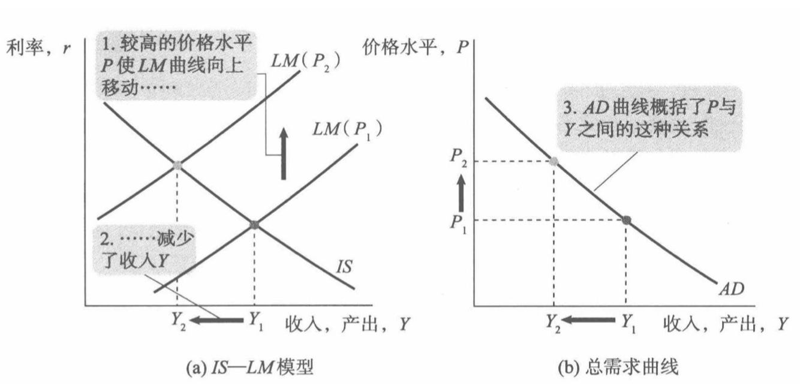

#### 第十二讲 《宏观经济学》
#### 总供给理论

雷浩然 湖南大学经贸学院

2021-04-15 

---

## 期中考试

考试时间
- 第十周周四晚

考试范围
- 考到 IS-LM
- AS-AD 这一章不考
  - 和其它班比较，我们进度略快

---

## 期中考试

复习建议：
1. 先把上课内容弄懂 (讲义，习题等)
1. 之后，再阅读教材
   - **据说**一般不考用马克思主义批判“西方经济学”的内容
1. 教材的课后习题提前看看，之后会讲

---

## 课程安排

- 今天继续总供给 (AS) 理论

- 下周(第八周)开始复习

问：
- 下周五的习题演练课，可否挪到第九周？

---

## Review: 从 IS-LM 到总需求曲线

$Y = C + I + G \quad\,\, {(\text{IS})}$

$M/P = L(r,Y) \quad {(\text{LM})}$

---

## Review: 从 IS-LM 到总需求曲线

$Y = C + I + G \quad\,\, {(\text{IS})}$

$M/P = L(r,Y) \quad {(\text{LM})}$

 
- 总需求曲线：不同 P 下均衡产出 $Y$ 的变化
   - 总需求：**A**ggregate **D**emand

---

## 总需求曲线：图示

---

## 总需求曲线：文字说明

1. 价格水平 P 上升，导致实际货币余额供给 $M\over P$ 下降
1. 由于 LM 曲线向下倾斜，这会导致利率 r 上升
1. 较高的利率抑制了投资，导致均衡产出下降

课本称为**利率效应**

---
## 课本的其他效应

效应二、 **财富效应**/**实际余额效应**
   - P 上升，导致人们持有的货币价值下降，进而导致消费水平下降  

效应三、 **税收效应**
   - P 上升，导致名义收入上升，税收上升，因此可支配收入下降，消费水平下降。

---

哪些因素会使总需求曲线(AD)移动？

- 我们之前讨论的**所有能使 IS 或 LM 移动**的冲击，都会使 AD 曲线移动
  - 财政政策，货币政策
  - 货币需求的外生冲击
  - 消费函数的外生冲击
  - ...

---

## Review: 需求冲击

- 如果某个冲击使总需求曲线移动，这个冲击被称为(**总**)**需求冲击** (Demand shock)

- 我们会在后面 AS-AD 的案例分析中，详细介绍各种需求冲击的例子

---

<!-- _class: lead  invert -->

# 同学问题答疑

---

Q: 货币需求上升会使 $r$ 上升，下面这种理解方式对不对？

- 有超额货币需求 $\Rightarrow$ 人们会买“货币” $\Rightarrow$ 货币 $P$ 下降 $\Rightarrow$ $\frac{M}{P}$ 上升 $\Rightarrow$ $r$ 上升

---

- 有超额货币需求 $\Rightarrow$ 人们会买“货币” $\Rightarrow$ 货币 $P$ 下降 $\Rightarrow$ $\frac{M}{P}$ 上升 $\Rightarrow$ $r$ 上升

这个逻辑链不对。

- “货币 P 下降” 不对，在 IS-LM 分析中 P 是不会变的。因此，供给侧的 $M \over P$ 也不变
- P 是**价格水平**或**价格指数**，不是“货币的价格” 
- 即使真的要给货币一个“价格”，也应该是 r, 不是 P. 因为“利率是持有货币的机会成本”

---

Q: 为什么 $I <S$ 表示超额产品供给，此时Y下降？

---

Q: 为什么 $I <S$ 表示超额产品供给，此时Y下降？

- 首先，(总)投资等于(总)储蓄是会计恒等式，所以 $S\equiv I +$ 存货。

  - 注：这里的 $I$ 表示的是计划投资

- 然后，$I<S$ 说明存货 $> 0$, 也就是说**生产多了没卖出去**，也就是有**超额产品供给**

- 最后，这时企业会降低产量，均衡时存货 = 0. 所以 Y 会下降

---

Q: 分不清**内生变量**和**外生变量**，担心会搞错。

---

Q: 分不清**内生变量**和**外生变量**，担心会搞错。

- 掌握常见的外生变量即可
  - 财政政策的 G, 
  - 货币政策的 M, 
  - 边际消费倾向 $\beta$. 
- 这些是需要熟悉掌握的，别的边边角角没记住也无所谓。

---

Q: 分不清**内生变量**和**外生变量**，担心会搞错。

- 要记得这些变量是**内生**的:

  - Y 和 r. 它们由 IS 和 LM 的交点决定
  - C 和 I. 知道了 Y 和 r 后，它们由消费函数和投资函数，分别代入 Y 和 r 算出来  

---

<!-- _class: lead  invert -->

# 总供给 (AS)

---

总供给在长期和短期中的表现完全不同

- 长期总供给 (LRAS) 
- 短期总供给 (SRAS)

---

## 长期均衡：古典情形

- 长期中，价格和工资可以自由调整
- 产出维持在自然水平： $\bar Y$
   - 总需求的变动不影响均衡产出 
   - $Y = F(\bar K, \bar L)$

---
货币中性

---

## 货币中性

长期内
- 货币供给的变化只影响名义量
   - 名义 价格 𝑃, 名义工资 𝑊, 货币余额 𝑀
- 不影响实际量
   - 产出 𝑌 , 消费 𝐶, 实际货币余额 M/P, 实际工资 W/P   
